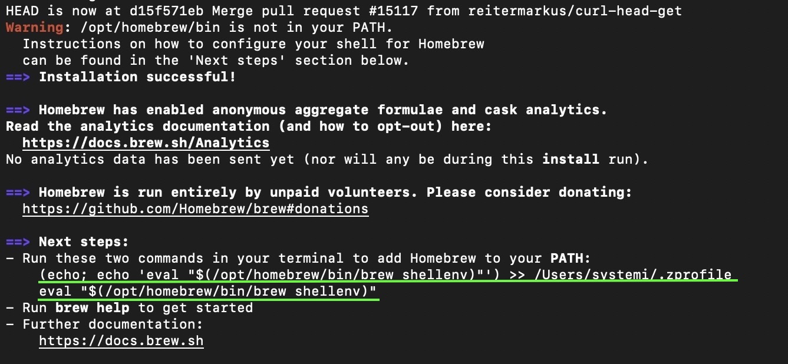

================================================================
**パッケージ管理ソフト"Brew"の導入**
================================================================

※ 既に導入している場合には次の操作へ進む。

Brewをインストールする
================================================================

.. hint:: ターミナルは **Command + Space** を押し、Spotlight検索で、 **terminal.app** と入力することで起動できる。

| 以下のコマンドをターミナルに貼り付け実行する。

.. code-block:: bash

    /bin/bash -c "$(curl -fsSL https://raw.githubusercontent.com/Homebrew/install/HEAD/install.sh)"

| パスワードを聞かれた場合は自身のPCのパスワードを入力
| 以下の画像のように表示された場合はEnterを押す。

.. image:: ../_static/img/ENTER.PNG
    :scale: 70%

|
| 以下の画像の様になれば、インストールは終了となる。
| Warningが出ているが、PATHが通って無い事に対する警告であり、次でPATHを通すので無視して良い

BrewのPATHを通す
================================================================
.. attention:: 環境によってコマンドが変わるため、自身のターミナルからコピーして貼り付ける事。

| 画像の所にある以下の二つをそれぞれコピーしターミナルに貼り付け実行

.. code-block:: bash
    
    (echo; echo 'eval "$(/opt/homebrew/bin/brew shellenv)"') >> /Users/UserName/.zprofile

    eval "$(/opt/homebrew/bin/brew shellenv)"

|
| 最後に以下のコマンドをターミナルで実行し、画像の様になればBrewの導入は終了。

.. code-block:: bash

    brew help

